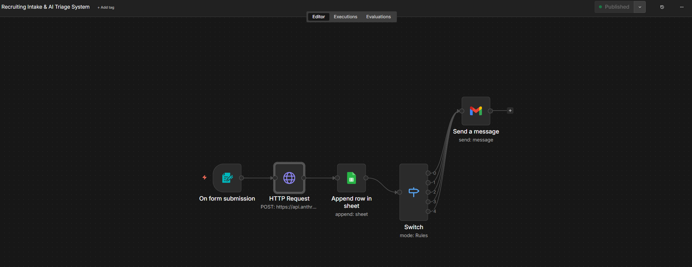
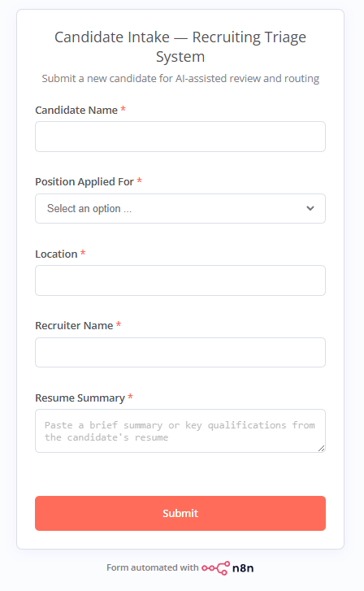
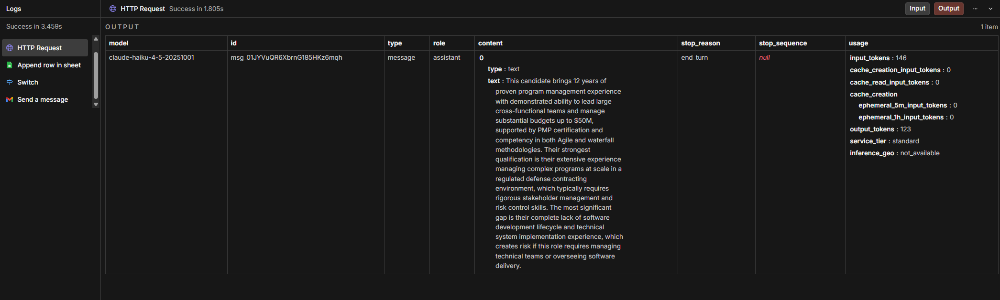
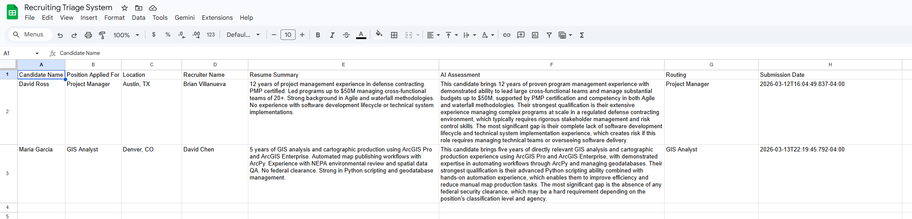
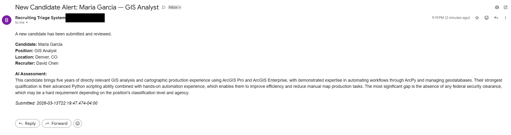

# AI-Enabled Recruiting Triage System

An automated candidate intake and routing workflow built in n8n with Claude API integration. Accepts candidate submissions via form, generates a structured AI assessment, logs to a tracking sheet, routes by position, and sends notifications — replacing a manual email-driven recruiting process.

## The Problem

A 70-person federal contract had 15 concurrent job openings and 100+ candidates flowing through the pipeline simultaneously. Every step was manual: resume review, task order lookup, interview scheduling, recruiter notifications, and status tracking all ran through email and memory. The process consumed 15+ hours per week and candidates were falling through the cracks.

The original fix was a Power Apps/Power Automate system that automated the full lifecycle — intake through EOD security handoff — inside the Microsoft ecosystem. **This project rebuilds the core intake and routing pattern in n8n to prove the design is platform-agnostic, then adds an AI classification layer that didn't exist in the original.**

## Demo

**[Watch the Loom walkthrough →](#)** *(link coming soon)*

## Screenshots

### n8n workflow — 5-node pipeline from intake to notification


### Form intake — candidate submission with resume summary


### AI assessment — Claude API generates structured candidate evaluation


### Google Sheets — candidate record with AI assessment logged automatically


### Email notification — technical lead receives candidate summary and AI assessment


## What the System Does

1. **Form Intake** — Captures candidate name, position, location, recruiter, and resume summary via n8n's built-in form trigger
2. **AI Assessment** — Calls the Claude API (Haiku) with a structured prompt that returns three sentences: relevant experience summary, strongest qualification, and the most important gap or risk
3. **Database Logging** — Writes the full candidate record plus AI assessment to Google Sheets with a timestamp
4. **Position Routing** — A Switch node routes candidates to the correct technical lead bucket based on position applied for (5 branches: Software Engineer, Systems Administrator, Project Manager, GIS Analyst, Security Analyst)
5. **Automated Notification** — Sends a Gmail alert to the assigned technical lead with the candidate summary and AI assessment

## Architecture

```
Form Submission
      │
      ▼
Claude API Call (HTTP Request)
      │
      ▼
Google Sheets Log (Append Row)
      │
      ▼
Switch Node (Route by Position)
      │
      ├── Software Engineer ──┐
      ├── Systems Admin ──────┤
      ├── Project Manager ────┤──▶ Gmail Notification
      ├── GIS Analyst ────────┤
      └── Security Analyst ───┘
```

## Stack

| Component | Tool | Purpose |
|-----------|------|---------|
| Orchestration | n8n (self-hosted via Docker) | Workflow engine |
| AI Layer | Claude API (Haiku) | Resume assessment |
| Database | Google Sheets | Candidate tracking log |
| Notification | Gmail | Technical lead alerts |
| Hosting | Docker Desktop (local) | Zero-cost self-hosted runtime |

## Setup

### Prerequisites

- [Docker Desktop](https://www.docker.com/products/docker-desktop) installed and running
- [Anthropic API key](https://console.anthropic.com) with credits loaded
- Google account with Sheets and Gmail access

### 1. Start n8n

```bash
docker run -it --rm --name n8n -p 5678:5678 -v n8n_data:/home/node/.n8n docker.n8n.io/n8nio/n8n
```

Open `http://localhost:5678` in your browser.

### 2. Import the Workflow

1. In n8n, click **Import from file** in the workflow menu
2. Select `workflow/recruiting-triage-system.json` from this repo
3. The full workflow will load onto the canvas

### 3. Configure Credentials

You'll need to set up three credentials inside n8n:

- **Anthropic API Key** — Paste into the `x-api-key` header on the HTTP Request node
- **Google Sheets** — OAuth2 connection (n8n will walk you through the consent flow)
- **Gmail** — OAuth2 connection (same Google account)

Copy `.env.example` to `.env` for reference. API keys go directly into n8n's credential manager — not into environment variables.

### 4. Create the Google Sheet

Create a spreadsheet named **Recruiting Triage System** with these column headers in Row 1:

| A | B | C | D | E | F | G | H |
|---|---|---|---|---|---|---|---|
| Candidate Name | Position Applied For | Location | Recruiter Name | Resume Summary | AI Assessment | Routing | Submission Date |

### 5. Publish and Test

1. Click **Publish** in n8n to activate the workflow
2. Copy the **Production URL** from the Form Trigger node
3. Open the URL, submit a test candidate, and verify:
   - AI assessment generates in the workflow output
   - Row appears in Google Sheets
   - Email notification arrives in your inbox

## Design Decisions

**Why n8n over Power Automate?** The original system ran in Power Automate inside a Microsoft-locked environment. Rebuilding in n8n proves the workflow logic is platform-agnostic — it's a design pattern, not a vendor dependency.

**Why Claude API (Haiku)?** Fast, cheap, and structured enough for a three-sentence assessment prompt. At demo volume, total API cost is under $0.10. Haiku's speed keeps the form-to-notification cycle under 4 seconds.

**Why Google Sheets instead of Airtable?** Zero setup friction, free, and the recruiter audience already knows Sheets. In a production deployment this would be a proper database — but for a demo, the important thing is that the data lands somewhere queryable.

**Why a single Gmail node for all 5 routes?** In production, each route would go to a different technical lead. For the demo, all 5 branches converge on one inbox to show the routing logic works without requiring 5 separate email accounts.

## Related Work

This project is one component of a broader recruiting and onboarding automation system. The full production version — built in Power Apps and Power Automate — processed 150+ candidates across 15 concurrent positions on a live federal contract. See the [Recruiting Automation Case Study](docs/case-study-recruiting-automation.md) for the complete breakdown.

## Built by

**Brian Villanueva** — Business Systems Architect | Workflow Automation | AI-Enabled Process Design

[LinkedIn](https://linkedin.com/in/brianvillanueva) · bav401@gmail.com
